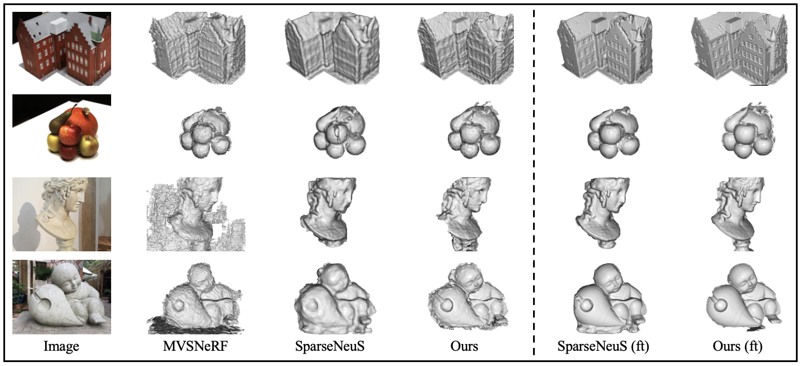

# GenS
GenS is an end-to-end generalizable neural surface reconstruction method that uses the multi-scale volume to reconstruct globally smooth surfaces and recover more high-frequency details. It leverages the mult-scale feature-metric consistency to impose the multi-view consistency in the more robust feature space, and utilizes the more accurate geometry of the dense inputs to teach the model with sparse inputs. Details are described in our paper:
> GenS: Generalizable Neural Surface Reconstruction from Multi-View Images
>
> Rui Peng, Xiaodong Gu, Luyang Tang, Shihe Shen, Fanqi Yu, Ronggang Wang
>
> NeuIPS 2023 ([OpenReview](https://proceedings.neurips.cc/paper_files/paper/2023/file/b29ab822442a1616f9bd390fddf6e425-Paper-Conference.pdf))

<p align="center">
    
</p>

*If there are any bugs in our code, please feel free to raise your issues.*

## ⚙ Setup
#### 1. Recommended environment
```
conda create -n gens python=3.10.9
conda activate gens
pip install -r requirements.txt
conda install -c conda-forge sparsehash
pip install --upgrade git+https://github.com/mit-han-lab/torchsparse.git@v2.1.0
```

#### 2. DTU Dataset

We only train our model on DTU dataset. We adopt the full resolution ground-truth depth maps and RGB images, and use the camera parameters prepocessed by CasMVSNet or MVSNet. Simply, please follow the instruction [here](https://github.com/prstrive/UniMVSNet/tree/main#2-dtu-dataset) of UniMVSNet to prepare the dataset. We generate pseudo depth maps using the model trained with dense depths to supervise the model with sparse inputs, and download them from [here](https://drive.google.com/file/d/1OyPoj56wV3OEPctIKUbrCEOh0sPQTKo9/view?usp=sharing). The final data structure is just like this:
```
dtu_training                          
  ├── Cameras
    ├── 00000000_cam.txt
    ├── ...             
    ├── pair.txt
  ├── Depths_raw
  ├── Pseudo_depths
  └── Rectified_raw
```
`Rectified_raw` is the full resolution RGB images provided in [DTU](http://roboimagedata2.compute.dtu.dk/data/MVS/Rectified.zip). We use the same training and testing split as SparseNeuS, please refer to [here](datasets/dtu_split) for more details.

For testing, you can download the testing data prepared by SparseNeuS [here](https://connecthkuhk-my.sharepoint.com/personal/xxlong_connect_hku_hk/_layouts/15/onedrive.aspx?id=%2Fpersonal%2Fxxlong%5Fconnect%5Fhku%5Fhk%2FDocuments%2Fsparseneus%2FDTU%5FTEST%2Ezip&parent=%2Fpersonal%2Fxxlong%5Fconnect%5Fhku%5Fhk%2FDocuments%2Fsparseneus&ga=1), which contains some object masks for cleaning the mesh. Put it to `<your DTU_TEST path>` For quantitative evaluation, you need to download the ground-truth points from the [DTU website](https://roboimagedata.compute.dtu.dk/?page_id=36) and put it to `<your GT_POINTS path>`.

#### 3. BlendedMVS Dataset

Download [BlendedMVS](https://drive.google.com/file/d/1ilxls-VJNvJnB7IaFj7P0ehMPr7ikRCb/view) 
for evaluation. The data structure is just like this:
```
blendedmvs                          
  ├── 5a0271884e62597cdee0d0eb
  ├── blended_images
  ├── cams                
  ├── 5a3ca9cb270f0e3f14d0eddb
  ├── ...
```

## 📊 Testing

#### 1. Download models or precomputed points
Download our pretrained model and put it to `<your CKPT path>`.
<table align="center">
  	<tr align="center">
  	    <td>CKPT</td>
  	    <td>Train Res</td>
		<td>Train View</td>
		<td>Test Res</td>
		<td>Test View</td>
		<td>Mean Cham. Dist.↓</td>
	</tr>
	<tr align="center">
	    <td><a href="https://drive.google.com/file/d/1c4lvUrSNZxGmagSQf9nU1j6ImWh7OiQq/view?usp=sharing">gens</a></td>
		<td>480X640</td>
		<td>5 (4src)</td>
		<td>480X640</td>
		<td>3 (2src)</td>
		<td>1.34</td>
	</tr>
</table>

You can also download our precomputed DTU points through direct inference [here](https://drive.google.com/drive/folders/1pVpD2aDZsAwYzbC3H3cgXVbqRYKl8VTL?usp=sharing) or after a fast fine-tuning [here](https://drive.google.com/drive/folders/1BSNaI4LKFLaQix5fMQv6BFR22tisoymE?usp=sharing).

#### 2. DTU testing

We define all information like the model structure and testing parameters in the configuration file. We use the `./confs/gens.conf` file for training and testing. You need to first specify the correct values in your own environment, such as `<your dataset path>` and `<your output save path>`. You can use our default testing configurations and the model structure. Once everything is ready, you can simply start testing via:
```
bash ./scripts/run.sh --mode val --resume <your CKPT path>
```
This will predict all scenes in the [test split](/home/pengr/Documents/GenS/datasets/dtu_split/test.txt) at view index 23 by default. If you want to get the results at other views (e.g., view43), you can change the `ref_view` under the `val_dataset` namespace in configuration file. Meanwhile, you can also specify `scene` list under the `val_dataset` namespace to test on a single scene like `scene=[scan24,scan55]`.

Optionaly, you can add `--clean_mesh` command to generate the filtered mesh, but you need to note that the mask used in `--clean_mesh` command is from MVSNet and is not the correct object mask used during the [quantitative evaluation](evaluation/clean_meshes.py).

Before evaluation, to generate the clean meshes using the correct mask, you need clean the mesh first:
```
python evaluation/clean_meshes.py --root_dir <your DTU_TEST path> --out_dir <your output save path>/meshes
```

Then run the quantitative evaluation:
```
python evaluation/dtu_eval.py --dataset_dir <your GT_POINTS path> --out_dir <your output save path>
```

You need to pay attention to the filename of meshes in `evaluation/clean_meshes.py` file, and we use `scan24_epoch0.ply` for scene 24 by default. In our paper, we test at the low resolution of 480X640, and you can get the better performance if you test at a higher resolution.

#### 3. BlendedMVS testing

Similar to the evaluation on DTU, you can test on BlendedMVS dataset through the command `./scripts/run.sh` and change the configuration file to `confs/gens_bmvs.conf`, and you can also run the python command:
```
python main.py --conf confs/gens_bmvs.conf --mode val --resume <your CKPT path> --clean_mesh
```
Here, we recommand to add the `--clean_mesh` command. You can change or add more testing scenes through change `scene`. Note that camera poses in BlendedMVS have a great difference, you need to make sure that the bounding box fits as closely as possible to the object you want to reconstruct, e.g., adjusting `factor` and `num_interval`.

## ⏳ Training & Fine-tuning

#### 1. DTU training

Similarly, you need to first specify the value in `confs/gens.conf` file and then run:
```
bash ./scripts/run.sh --mode train
```
By default, we employ the *DistributedDataParallel* mode to train our model on 2 GPUs.

#### 2. DTU fine-tuning

We use `confs/gens_finetune.conf` file to config the fine-tuning on DTU dataset. For convenience, we use `scripts/finetune.sh` file to fine-tune all testing scenes at both 23 and 43 views:
```
bash ./scripts/finetune.sh --resume <your CKPT path>
```

You can change the scene and view through the `--scene` and `ref_view` command directly or through modifying the configuration file. 

#### 2. BlendedMVS fine-tuning

we use `confs/gens_bmvs_finetune.conf` file to config the BlendedMVS fine-tuning. Similarly, you need to first make sure the bounding box is compact enough and then run:
```
python main.py --conf confs/gens_bmvs_finetune.conf --mode finetune --resume <your CKPT path>
```

Note that we save the optimized volume and implicit surface network after fine-tuning. And if you want to resume the fine-tuned model, you need add `--load_vol` command to distinguish it from the oridinary ckpt.

## ⚖ Citation
If you find our work useful in your research please consider citing our paper:
```
@article{peng2024gens,
  title={GenS: Generalizable Neural Surface Reconstruction from Multi-View Images},
  author={Peng, Rui and Gu, Xiaodong and Tang, Luyang and Shen, Shihe and Yu, Fanqi and Wang, Ronggang},
  journal={Advances in Neural Information Processing Systems},
  volume={36},
  year={2024}
}
```

## 👩‍ Acknowledgements

Thanks to [NeuS](https://github.com/Totoro97/NeuS), [SparseNeuS](https://github.com/xxlong0/SparseNeuS) and [Geo-NeuS](https://github.com/GhiXu/Geo-Neus).

